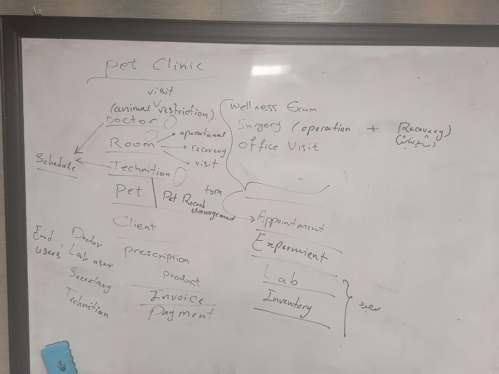
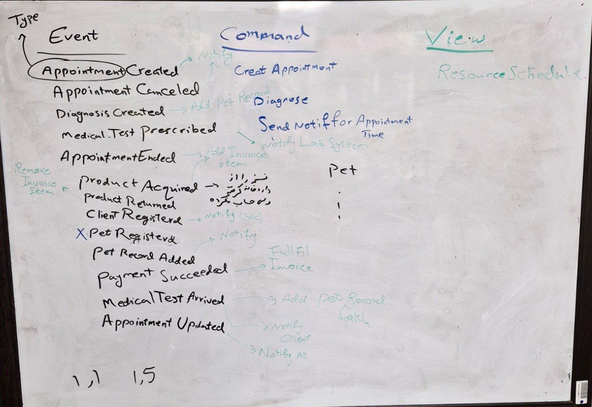
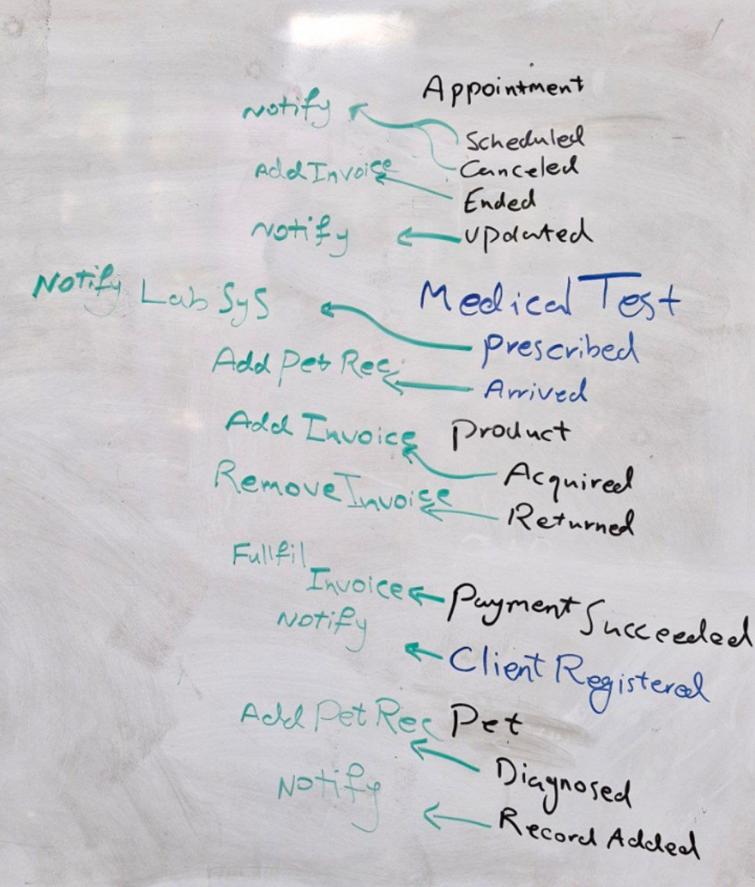
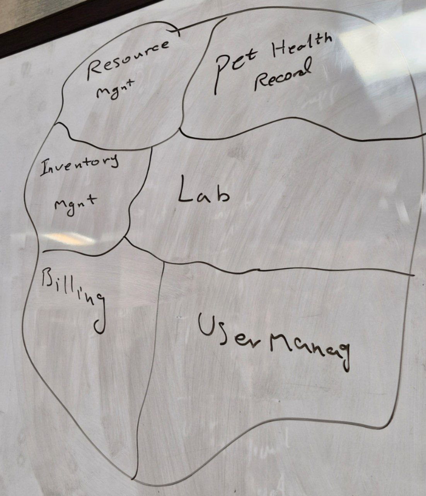
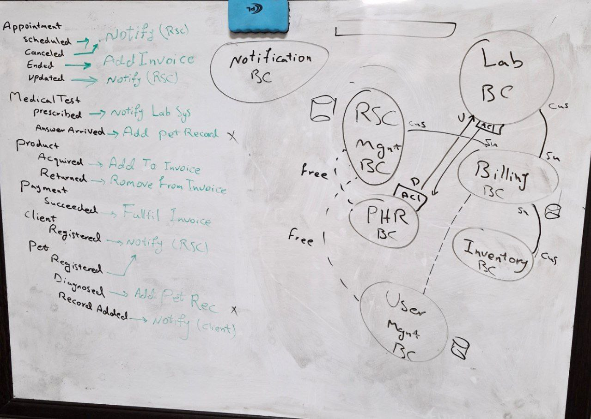
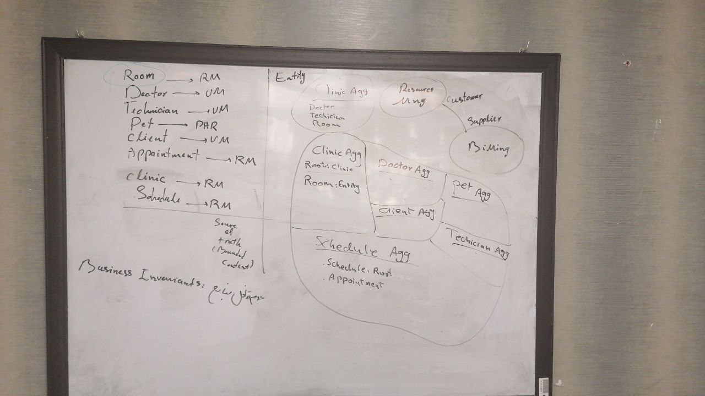
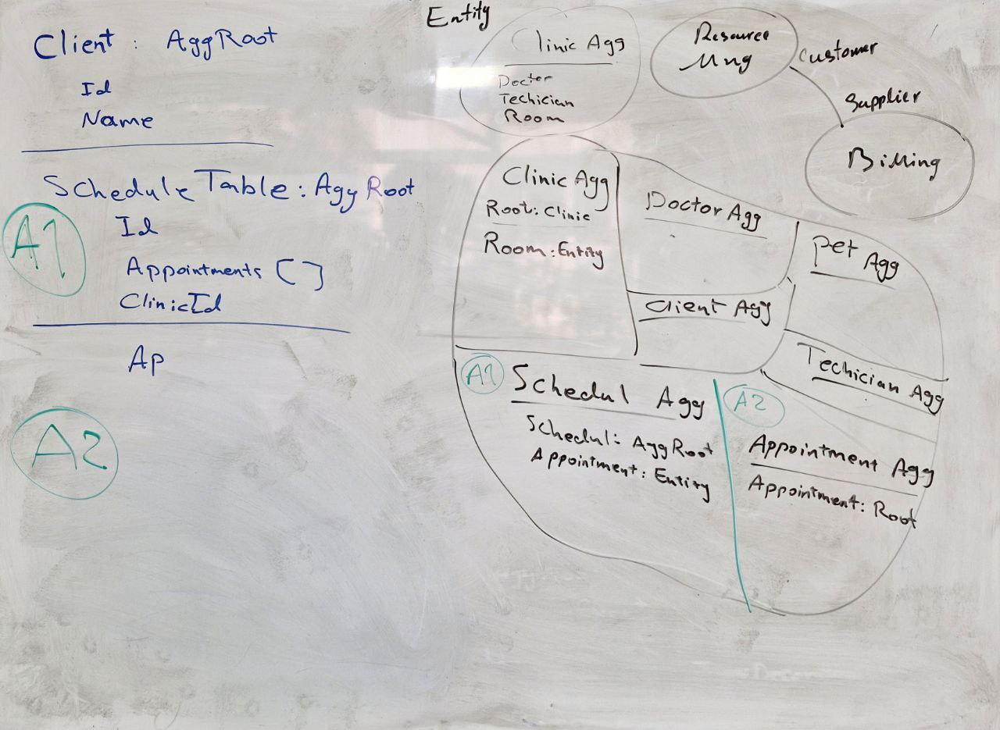
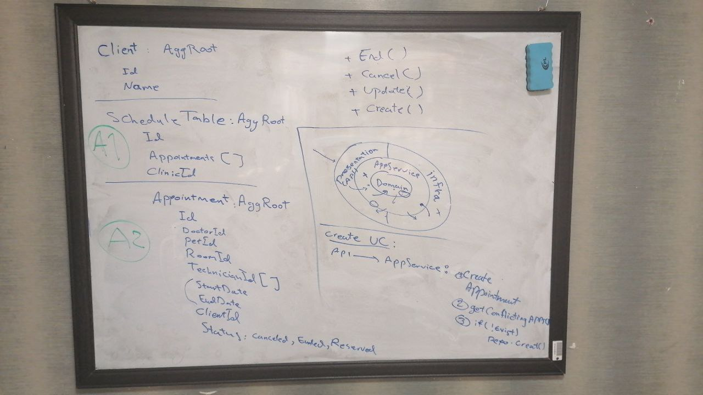

# Event Storming
We started to know more about the project by considering that our CTO is the domain expert and we are the team that is going to implement the project. So we started asking questions about the project and the domaing expert concerns.

## Specifying the project

At first we came to these details:

What we came at this step was:
- what operations are needed
- what scenarios exists
- who are the end-users
- what parts of the system already exists and what should be developed

## Event Stormig
Then with the help of the domain expert, domain events extracted:

## Project Decomposition
Next the overal project composition shaped out

## Bounded Context Connections
In this stpe the connection of bcs and their types (core, supporting, generic) were elicitated.

## Clean Architeture Mapping
Then a the client aggregate in resource management bc was mapped to clean architecture as an example.
